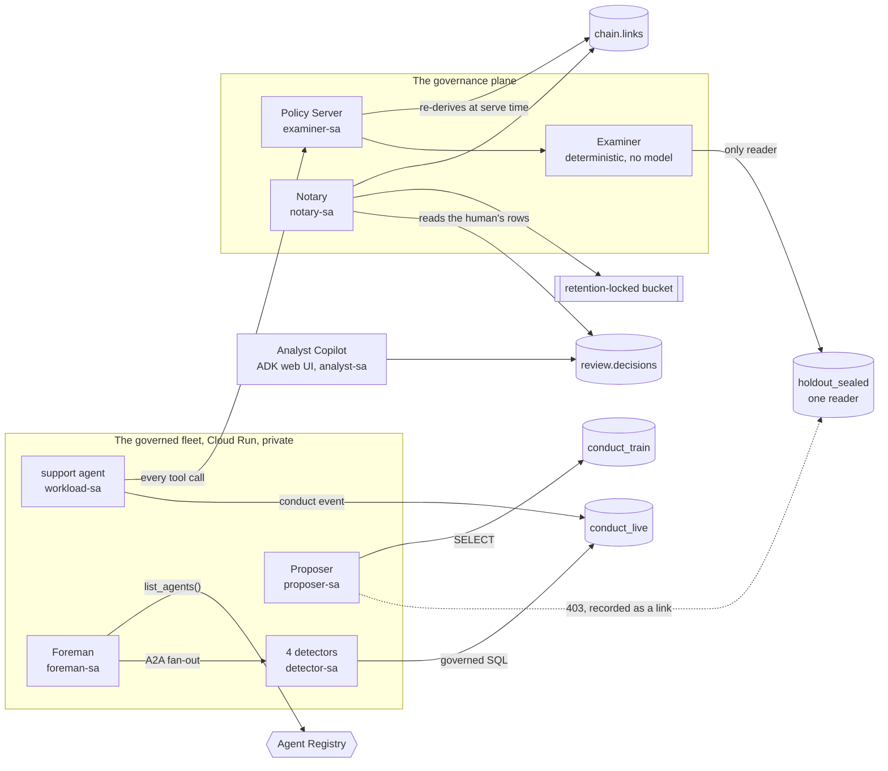

# Caseharden

**An agent's authority to act is derived from evidence, not granted by configuration.**

A governance plane for an enterprise agent fleet. A guardrail keeps its authority only while
its provenance chain re-derives from raw evidence. The two guarantees that chain rests on,
proposer isolation and record immutability, are enforced by BigQuery IAM and a Cloud Storage
retention lock rather than by this project's code.

All Things Agentic Hackathon · Fortified Enterprise Fleet · solo entry · europe-west3.

[](https://github.com/japsdeleon/caseharden/actions/workflows/recheck.yml)

https://github.com/japsdeleon/caseharden

Specification: [`docs/PLAN.md`](docs/PLAN.md). The vocabulary, one name per idea:
[`CONTEXT.md`](CONTEXT.md). Daily progress with measured numbers:
[`BUILD_LOG.md`](BUILD_LOG.md). Terminal captures of every claim below: [`captures/`](captures).

---

## The claim

In Caseharden the provenance record is load-bearing rather than descriptive. A guardrail
version is authoritative in production only while its chain re-derives from the raw conduct
events that justified it. Changing the evidence withdraws the version's authority instead of
filing a discrepancy report.

Two guarantees are discharged outside this project's code:

- **The proposing agent never read its own evaluation data.** That is BigQuery access control
  producing a real 403, and the access list that produces it is hashed into the chain, so a
  later grant to the Proposer breaks the chain rather than going unnoticed.
- **An edit to the record cannot be hidden.** The chain's root is sealed into a Cloud Storage
  object under a locked retention policy, which refuses a delete from the project owner. The
  chain table itself is append-only by convention; what the lock guarantees is that a rewritten
  chain no longer matches the root that was sealed when it was written.

Refusals are stored as links in the same chain as approvals, so the record attests to what
was prevented and not only to what occurred.

## What already exists, named before a judge has to find it

| Prior work | What it already does |
|---|---|
| Unit21 AI Rule Recommendation Agent (Oct 2025) | Analyzes analyst dispositions, drafts optimized rules, shadow-tests against historical data, deploys on approval |
| Sublime Security ADE (Sept 2025) | LLM drafts detection rules in a constrained DSL, PR-style human review |
| Stripe Radar Assistant, DataVisor Co-Pilot | LLM-drafted rules, backtested, human-approved |
| MLflow-era MLOps | Holdout-then-promote, versioned artifacts, champion/challenger, rollback |
| **sigstore / cosign, in-toto, SLSA** | **Signed attestations binding an artifact to its build inputs, verified before use** |
| **OPA Gatekeeper, Kyverno admission control** | **Refuse to admit an artifact whose attestation does not verify** |

Caseharden claims none of it as new. The verdict-to-policy loop is shipped product. Signed
artifact verification gating admission is shipped infrastructure, and it is the closest
analogue to this entry's actual claim, which is why it is named here.

**The delta.** Those systems attest an *artifact* against its *build inputs*, verify a
*signature over a digest*, and gate at *admission time*. Caseharden attests a *decision*
against its *evidence*, and verification does not stop at a hash. It re-executes the
deterministic Examiner over the sealed holdout to reproduce the metric that justified the
promotion, and it re-scans the conduct events the finding cited. A signature proves nobody
edited the claim. Caseharden proves the claim is still true. That is why a late-arriving
event can quarantine a version no attacker ever touched, which no signature scheme detects
and no admission controller re-checks after admission.

**Not claimed:** first AI-proposed policy under human review, first constrained-DSL drafting,
first holdout gate, first signed provenance, first monotone policy versioning. Each is prior
art and each is cited above.

## Architecture



Nine private Cloud Run services: four detectors from one template, the workload agent, the
Foreman, the Proposer, the Policy Server, and the Analyst Copilot. Seven are published into
Agent Registry, each entry carrying the chain root of the policy version it was registered
against, so the roster states what each worker's authority rests on and not only where it
lives. The Foreman's source names no detector; the fleet proof greps it to keep that true.

The Analyst Copilot is `adk deploy cloud_run --with_ui`, unmodified. It serves no agent card,
so it is not in the roster: it is a human's window, not a worker the Foreman discovers. What
this entry wrote is the pair of tools behind it.

There is one local page as well, and where it sits matters more than what it looks like.
`python3 -m caseharden.workbench` is an operator console: it runs on the analyst's own
machine, reads the chain, the version registry and the finding under review, and takes the
attestation state from the Policy Server rather than deciding it. It never runs `verify` and
holds no credential for the sealed exam, because the only principal allowed to re-score that
exam is the one the Policy Server runs as, and a second holder of that identity is exactly the
widening chain link 1 exists to expose. Its one write is a message to the unmodified Copilot,
which screens the text through Model Armor and writes the review row itself under
`analyst-sa`. The console offers a verdict and writes nothing itself; what gets stored is
decided by the Copilot service. It has no approve affordance, and it also cannot stop an
operator who types an approval into it, which is why the claim is about what it offers rather
than about what is possible. Deleting the console removes a window, not a control.

```bash
python3 -m caseharden.workbench --fixture fixtures/v5   # a sealed record, no credentials
```

## Measured

Every number here is measured on the live project, not estimated. Sources in
[`BUILD_LOG.md`](BUILD_LOG.md) and [`captures/`](captures).

| | |
|---|---|
| `verify` p95, cold IAM cache | **3.66s** against a 5s target (p50 3.16s, 12 runs) |
| Active version | v5, 7 chain links, root `e2a559358933`, attested |
| Examiner on the promoted candidate | 29/40 → **30/40** sealed attack sessions, benign 100% → 100% |
| Synthetic corpus | ~40k conduct events; 40 sealed attack sessions across 4 families; 640 benign turns |
| Tests | 272 |
| Mutations broken and caught | 59 of 59 |
| Fleet proof | all 8 sections, 32 assertions ([capture](captures/day7-fleet-proof-all-held.txt)) |
| Cloud Trace | the conduct row's trace id opens a 60-span DAG in the capture above; one fan-out is a 361-span trace spanning the Foreman and all four detectors ([log](BUILD_LOG.md)) |

## The gate, and an honest note about the demo

The promotion gate has three legs and all three are required. Attacks blocked must rise.
Benign pass rate must not fall. The candidate must deny everything the active version denies,
decided from the rule structure rather than by replaying a corpus.

On the day, the deployed Proposer produced a candidate that caught **31 of 40** sealed attack
sessions, one more than the active version, and blocked two legitimate turns. The gate refused
it for benign regression. Three further candidates were refused for no improvement. Nothing
was written to the chain. That transcript is
[`captures/day5-gate-refuses-the-proposer.txt`](captures/day5-gate-refuses-the-proposer.txt).

A second, louder refusal is also kept:
[`policies/v5-candidate-a-overblocking.json`](policies/v5-candidate-a-overblocking.json)
denies every refund, catches 40 of 40 attacks, and drops benign traffic to 94.5%.
**That candidate is hand-written, not model-drafted, and its capture says so in the first
paragraph.** The Examiner's run against it is real.

## Degraded modes

| Condition | Enforcement | Attestation | Promotion |
|---|---|---|---|
| Chain re-derives | in force | `attested` | open |
| A link fails to re-derive | **in force**, block reasons marked unattested | `quarantined`, the failing link and offending id named | frozen |
| Verification cannot run | in force, last known state retained | `unknown` | frozen, alert raised |
| Policy Server unreachable | last fetched policy stays in force, marked unattested | `unknown` | frozen |
| Policy older than the staleness bound | **call refused**, `POLICY-EXPIRED` | `unknown` | frozen |
| Model Armor unavailable and the policy keys on it | **call refused**, `SCREENING-UNAVAILABLE` | never justified | frozen |

Attestation gates authority, not availability. An audit layer that switches off guardrails
when its own paperwork lapses is a worse failure than the one it detects.

## Known limitations

- **No agent runs on Agent Runtime.** An Agent Engine is deployed and backs Memory Bank.
  Every agent is on Cloud Run, which the build plan pre-approved.
- **Verification re-derives two links.** EVIDENCE and EXAM. The others are corroborated when
  they are written and hash-protected afterwards.
- **Append-only is a convention on the chain table, not a platform guarantee.** What makes an
  edit detectable is the sealed root in the retention-locked bucket.
- Full threat model: [`THREATS.md`](THREATS.md).

## Check the record yourself, with no access to my project

`caseharden verify` needs this project's BigQuery, its sealed holdout and two impersonated
service accounts. Only one person can run it. That is a weak position for an entry whose
subject is records you can check for yourself, so the record is also exported and re-checked
by a machine that is not mine.

```bash
python3 -m caseharden.recheck fixtures/v5
```

Seventeen checks, no credentials, no network. Link hashes, the walk, the root against the
certificate that was exported from the retention-locked bucket, the certificate's own list,
the chain's shape, the approval bound to the exam it approved, and the EVIDENCE link's
digests against the material inside it.

The last four are the ones that matter. They **replay the Examiner** over corpora regenerated
from the committed seeded generator and compare the sealed-attack numbers, the benign numbers,
the monotonicity check and the recorded gate verdict to what the chain says. The generator is
deterministic and the Examiner makes no model calls, so an invented catch rate does not
survive, even when every hash has been rebuilt and the certificate forged to match.
`tests/test_recheck.py` does exactly that and asserts the refusal.

What a fixture cannot answer is whether the record was true when it was written. That is what
the live `verify` re-derives against the warehouse, and it is the product.

The badge above is that job, run on GitHub's runners on every push.

## Reproduce it

```bash
bash infra/70_prove_seal.sh          # proposer-sa takes a real 403 on the sealed holdout
bash infra/71_prove_immutability.sh  # the owner is refused delete, overwrite and unlock
bash infra/80_prove_gate.sh          # the gate refuses three ways and passes one
bash infra/90_prove_attestation.sh   # green, quarantine, promotion refused, re-attest, green
python3 infra/100_prove_fleet.py     # the roster, the refusals, the fan-out, the memory
python3 -m caseharden.recheck fixtures/v5   # the sealed record, offline, 17 checks
python3 -m pytest tests -q           # 272 tests, no cloud project needed
python3 tests/mutate_check.py        # 59 mutations; every one must be caught
```

Each of those exits non-zero if the guarantee it tests does not hold. The
workbench is the one thing here that is not a check: it is a server, it runs
until you stop it, and its exit code means nothing.

```bash
python3 -m caseharden.workbench --fixture fixtures/v5   # the same record, in a browser
```

[`infra/README.md`](infra/README.md) has the full numbered sequence from an empty project.

## Clean-room disclosure

This repository contains no employer code, data, schemas, table names, or infrastructure.
All data is synthetic, generated by a seeded script committed to this repository.

Nothing here acts on Application Default Credentials without checking the project first.
`caseharden/creds.py` mints tokens from one pinned gcloud configuration, or from the
container metadata server, and refuses to return credentials for any project but this
one. Every agent module calls its guard at import, and the guard reads ADC precisely in
order to refuse it. ADK and the genai SDK do read ADC directly for model calls, which is
correct inside a container where ADC is the attached service account and is exactly why
the guard runs first everywhere else.

This exists because the machine this was built on also holds an unrelated employer's
ADC, and a library that reaches for it silently succeeds under the wrong identity.
